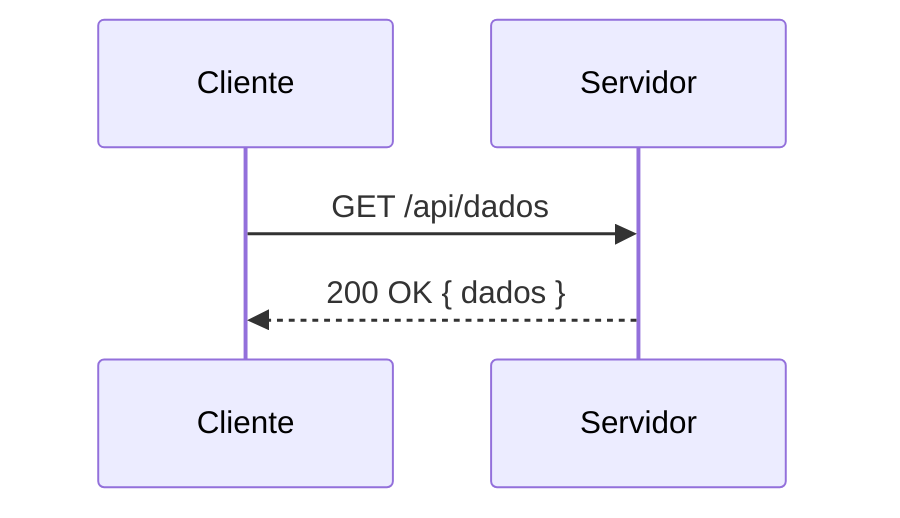

# md-to-pdf

Conversor de arquivos **Markdown → PDF** com suporte a blocos protegidos (`:::protected`).
Blocos protegidos são rasterizados como imagem PNG no PDF — o texto **não pode ser selecionado
nem copiado** por leitores de PDF.

Desenvolvido para uso didático no SENAC (TADS — Desenvolvimento de Software Web).

---

## Funcionalidades

- Converte todos os arquivos `.md` de um diretório para `.pdf` em lote.
- Renderiza com **estilo visual idêntico ao GitHub** (headings, tabelas, listas, código, blockquotes).
- Blocos `:::protected` são renderizados como imagem — gabaritos e respostas ficam protegidos.
- **Syntax highlighting** nativo para Java, JavaScript/TypeScript, HTML/XML e CSS.
- **Diagramas Mermaid** (blocos ` ```mermaid `) são renderizados como imagem via Docker.
- Saída em **PDF/A-3b** — documento autocontido, arquivável e validável.
- **Metadados legíveis** (título, autor, assunto) embutidos no PDF via frontmatter YAML.
- Configuração via `application.yml` ou variáveis de ambiente.
- Suporte a extensões **GitHub Flavored Markdown**: tabelas, strikethrough, task lists, autolink.

---

## Pré-requisitos

| Ferramenta | Versão mínima | Observação |
|---|---|---|
| Java | 21 | |
| Maven | 3.9+ | |
| Docker | qualquer | Necessário apenas para diagramas Mermaid |

> **Sem banco de dados.** A aplicação é um utilitário CLI (Spring Boot `CommandLineRunner`).

---

## Estrutura do projeto

```
md-to-pdf/
├── pom.xml
├── .editorconfig
├── markdowns/                          ← diretório padrão de entrada (.md)
│   └── avaliacao-dsw.md               ← arquivo de exemplo
├── pdfs/                               ← diretório padrão de saída (.pdf)
└── src/main/
    ├── java/br/edu/senac/mdpdf/
    │   ├── MdToPdfApplication.java
    │   ├── config/
    │   │   └── MdToPdfProperties.java  ← @ConfigurationProperties
    │   ├── model/
    │   │   └── PdfMetadata.java        ← metadados do PDF (título, autor, assunto)
    │   ├── service/
    │   │   ├── MarkdownService.java    ← MD → HTML (Flexmark + pré-processamento)
    │   │   ├── ProtectedBlockService.java  ← :::protected → imagem base64
    │   │   ├── MermaidService.java     ← blocos mermaid → PNG via Docker
    │   │   ├── SyntaxHighlighter.java  ← syntax highlighting nativo (hljs-*)
    │   │   └── PdfService.java         ← HTML → PDF/A-3b (OpenHTMLtoPDF + PDFBox)
    │   └── runner/
    │       └── ConversionRunner.java   ← orquestra a conversão em lote
    └── resources/
        ├── application.yml
        ├── fonts/                      ← fontes Noto (Regular, Bold, Mono, Emoji)
        ├── icc/
        │   └── sRGB.icc               ← perfil ICC sRGB (obrigatório para PDF/A-3b)
        └── github.css                  ← folha de estilos GitHub (CSS 2.1)
```

---

## Dependências principais

| Biblioteca | Papel |
|---|---|
| [Flexmark](https://github.com/vsch/flexmark-java) `0.64.8` | Markdown → HTML com extensões GFM |
| [OpenHTMLtoPDF](https://github.com/danfickle/openhtmltopdf) `1.0.10` | HTML → PDF/A-3b (baseado em PDFBox) |
| `openhtmltopdf-svg-support` | Suporte a SVG embutido no PDF |
| [Jsoup](https://jsoup.org/) `1.18.3` | Converte HTML5 em XHTML válido para o OpenHTMLtoPDF |
| Apache PDFBox `2.0.24` | Rasterização PDF → imagem e pós-processamento de metadados |
| Apache XMPBox `2.0.24` | Sincronização de metadados XMP (transitivo via PDFBox) |

---

## Configuração

Todas as propriedades possuem valores padrão funcionais. Para sobrescrever, edite
`src/main/resources/application.yml` ou use variáveis de ambiente.

```yaml
mdpdf:
  input-dir:  ./markdowns   # env: MDPDF_INPUT_DIR
  output-dir: ./pdfs        # env: MDPDF_OUTPUT_DIR
  image-dpi:  144           # env: MDPDF_IMAGE_DPI  (144 = qualidade padrão, 192 = alta)
  author:                   # env: MDPDF_AUTHOR     (autor padrão; sobrescrito pelo frontmatter)
```

### Variáveis de ambiente

```bash
export MDPDF_INPUT_DIR=/home/usuario/provas
export MDPDF_OUTPUT_DIR=/home/usuario/provas/pdf
export MDPDF_IMAGE_DPI=192
export MDPDF_AUTHOR="Prof. Fernando Tsuda"
```

---

## Como executar

### Compilar e executar via Maven

```bash
./mvnw spring-boot:run
```

> Na primeira execução o Maven baixará as dependências (~50 MB).

### Gerar JAR e executar

```bash
./mvnw clean package -DskipTests

java \
  --add-opens=java.base/java.lang=ALL-UNNAMED \
  --add-opens=java.base/java.util=ALL-UNNAMED \
  --add-opens=java.desktop/sun.awt=ALL-UNNAMED \
  --add-opens=java.desktop/sun.font=ALL-UNNAMED \
  -jar target/md-to-pdf-1.0.0.jar
```

### Executar com diretórios customizados

```bash
MDPDF_INPUT_DIR=/suas/provas \
MDPDF_OUTPUT_DIR=/saida/pdfs \
./mvnw spring-boot:run
```

---

## Metadados PDF

Os PDFs gerados são **PDF/A-3b** e carregam metadados legíveis no campo
"Propriedades do Documento" de qualquer leitor de PDF (Adobe Acrobat, Chrome, Evince, etc.).

### Frontmatter YAML

Adicione um bloco `---` no início do arquivo `.md` para definir os metadados:

```markdown
---
title: Aula 03 — Normalização de Dados
author: Prof. Fernando Tsuda
subject: Banco de Dados II — TADS
---

# Conteúdo do documento aqui...
```

O frontmatter é removido antes da renderização — **não aparece no corpo do PDF**.

### Campos suportados

| Chave no frontmatter | Variável de ambiente | Campo no PDF | XMP |
|---|---|---|---|
| `title` | — | `Title` | `dc:title` |
| `author` | `MDPDF_AUTHOR` | `Author` | `dc:creator` |
| `subject` | — | `Subject` | `dc:description` |

O frontmatter tem prioridade sobre a variável de ambiente `MDPDF_AUTHOR`.

### Fallback automático do título

Quando `title` não está no frontmatter, o conversor usa:
1. Primeiro heading `# ` do documento.
2. Nome base do arquivo (sem `.md`), como último recurso.

### Campos definidos automaticamente

| Campo | Valor |
|---|---|
| `Creator` / `xmp:CreatorTool` | `"md-to-pdf"` |
| `CreationDate` / `xmp:CreateDate` | Data e hora da conversão |
| `pdfaid:part` / `pdfaid:conformance` | `1` / `B` (PDF/A-3b) |

---

## Sintaxe dos blocos protegidos

Um bloco `:::protected` deve ter os delimitadores em **linhas próprias**:

```markdown
Texto normal — visível e copiável no PDF.

:::protected
## Gabarito — Questão 1

A resposta correta é **B**, pois ...

| Critério           | Pontos |
|--------------------|--------|
| Definição correta  | 0,5    |
| Exemplo válido     | 0,5    |
:::

Mais texto normal aqui.
```

O bloco aceita qualquer markdown válido: headings, listas, tabelas, código, etc.
No PDF gerado o conteúdo aparece com fundo amarelo e borda laranja para indicar
visualmente que é um trecho protegido.

### Regras do delimitador

| Válido | Inválido |
|---|---|
| `:::protected` na linha inteira | `:::protected` no meio de uma linha |
| `:::` na linha inteira (fecha) | `:::` seguido de texto na mesma linha |
| Qualquer markdown dentro do bloco | Blocos `:::protected` aninhados |

---

## Diagramas Mermaid

Blocos de código com a linguagem `mermaid` são renderizados como imagem PNG via
[mermaid-cli](https://github.com/mermaid-js/mermaid-cli) no Docker. O Docker deve estar em
execução na máquina host.

````markdown

````

O diagrama é centralizado e nunca quebrado entre páginas no PDF.

> **Nota:** na primeira execução o Docker fará o pull da imagem
> `ghcr.io/mermaid-js/mermaid-cli/mermaid-cli` (~300 MB).
> Se o Docker não estiver disponível a conversão falhará para arquivos que contêm diagramas Mermaid.

---

## Syntax highlighting

Blocos de código delimitados por ` ``` ` com identificador de linguagem recebem coloração
automática usando as classes CSS `hljs-*` definidas no `github.css`.

Linguagens suportadas:

| Identificador | Linguagem |
|---|---|
| `java` | Java |
| `javascript`, `js` | JavaScript |
| `typescript`, `ts` | TypeScript |
| `html`, `xml`, `xhtml` | HTML / XML |
| `css` | CSS |

Blocos sem identificador de linguagem são exibidos em fonte monospace sem coloração.

---

## Pipeline de conversão

```
arquivo.md
    │
    ├─ 0. BOM UTF-8 removido (se presente)
    │      Frontmatter YAML extraído → PdfMetadata (title, author, subject)
    │      Frontmatter removido do conteúdo antes de renderizar
    │
    ├─ 1. Regex localiza ```mermaid...```
    │         │
    │         ▼  MermaidService
    │         └─ mmdc via Docker → PNG base64 → 
    │
    ├─ 2. Regex localiza :::protected...:::
    │         │
    │         ▼  ProtectedBlockService
    │         ├─ MD do bloco → HTML (Flexmark)
    │         ├─ HTML → PDF em memória (OpenHTMLtoPDF)
    │         ├─ PDF page 0 → BufferedImage (PDFBox, image-dpi)
    │         ├─ Recorte do espaço em branco inferior
    │         └─ BufferedImage → PNG base64 → 
    │
    ├─ 3. MarkdownService: Flexmark parseia o MD restante
    │      (tags  passam como HTML block — não são escapadas)
    │
    ├─ 4. SyntaxHighlighter aplica spans hljs-* nos blocos <pre><code class="language-*">
    │
    ├─ 5. HTML completo montado com github.css inline
    │
    └─ 6. PdfService
           ├─ OpenHTMLtoPDF → PDF/A-3b com perfil ICC sRGB embutido
           └─ PDFBox → metadados gravados no info dict e sincronizados no XMP
              → arquivo.pdf salvo em output-dir
```

---

## Por que os blocos ficam não-copiáveis

O conteúdo de `:::protected` é renderizado pelo **mesmo engine** (OpenHTMLtoPDF)
responsável pelo documento principal, depois rasterizado a imagem pelo PDFBox e
embedado como elemento ``. No PDF final esse trecho existe apenas como pixels —
Adobe Reader, Chrome PDF Viewer, Evince e similares não têm texto para selecionar.

> **Nota de segurança:** nenhuma proteção em PDF é absoluta contra OCR ou
> screenshots manuais. O objetivo é eliminar a cópia trivial via Ctrl+C —
> fricção suficiente para o contexto de avaliações presenciais.

Para proteção adicional, aplique senha de proprietário com `qpdf` após a geração:

```bash
qpdf --encrypt "" senha-professor 256 \
     --print=full --modify=none --extract=n --use-aes=y \
     -- entrada.pdf saida-protegido.pdf
```

---

## Exemplo de saída (log)

```
INFO  b.e.s.m.runner.ConversionRunner  : === md-to-pdf Converter ===
INFO  b.e.s.m.runner.ConversionRunner  : Entrada : /home/usuario/markdowns
INFO  b.e.s.m.runner.ConversionRunner  : Saída   : /home/usuario/pdfs
INFO  b.e.s.m.runner.ConversionRunner  : 2 arquivo(s) .md encontrado(s)
INFO  b.e.s.m.runner.ConversionRunner  : Convertendo: avaliacao-dsw.md
INFO  b.e.s.m.m.service.MarkdownService: 1 diagrama(s) Mermaid processado(s)
INFO  b.e.s.m.m.service.MarkdownService: 3 bloco(s) protegido(s) processado(s)
INFO  b.e.s.m.service.PdfService       : PDF gerado: /home/usuario/pdfs/avaliacao-dsw.pdf
INFO  b.e.s.m.runner.ConversionRunner  : Convertendo: lista-exercicios.md
INFO  b.e.s.m.service.PdfService       : PDF gerado: /home/usuario/pdfs/lista-exercicios.pdf
INFO  b.e.s.m.runner.ConversionRunner  : -----------------------------------
INFO  b.e.s.m.runner.ConversionRunner  : Concluído: 2 OK, 0 com erro
```

---

## Customização do estilo

O arquivo `src/main/resources/github.css` controla toda a aparência do PDF.
É CSS 2.1 puro (compatível com OpenHTMLtoPDF) — sem variáveis, flexbox ou grid.

Principais pontos de customização:

```css
/* Tamanho e margens da página */
@page {
    size: A4;
    margin: 20mm 25mm; /* top/bottom left/right */
}

/* Fonte e tamanho base */
body {
    font-family: Helvetica, Arial, sans-serif;
    font-size: 16px;
}

/* Cor de fundo do bloco protegido — em ProtectedBlockService.java */
background-color: #fffde7;  /* amarelo suave */
border-left: 4px solid #f59e0b; /* laranja */
```

Para alterar a aparência dos blocos protegidos, edite `PROTECTED_CSS` em
`ProtectedBlockService.java`.

---

## Limitações conhecidas

- **Syntax highlighting parcial:** suporte nativo para Java, JS/TS, HTML/XML e CSS.
  Outras linguagens são exibidas em monospace sem coloração.
- **Diagramas Mermaid requerem Docker:** a renderização usa `mermaid-cli` em container.
  Sem Docker, arquivos com blocos ` ```mermaid ` falham na conversão.
- **Emojis GFM** (`:rocket:`) não são renderizados — a extensão foi omitida
  por requerer assets externos.
- **Imagens externas** (``) não são carregadas por padrão no
  OpenHTMLtoPDF. Use imagens locais referenciadas com caminho absoluto ou base64.
- **Blocos protegidos aninhados** não são suportados.

---

## Licença

Uso interno SENAC — sem licença de distribuição.
